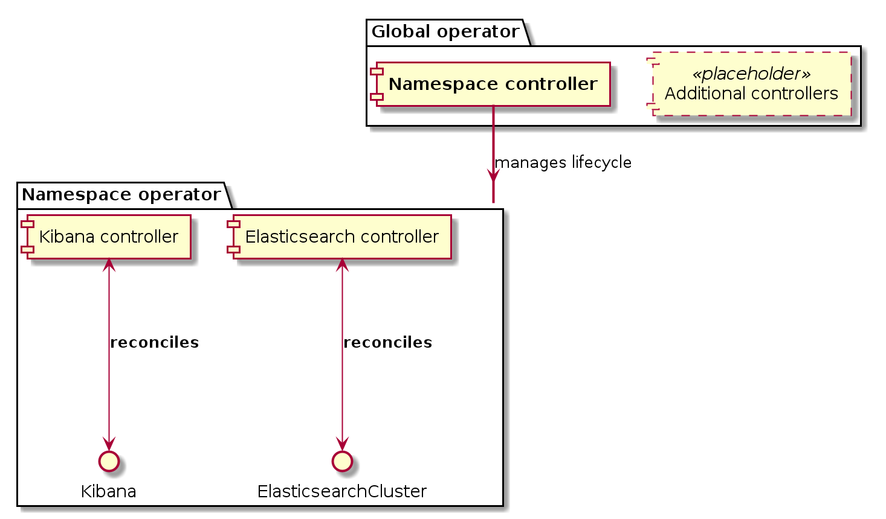

# 2. Global operator and namespaced operators

* Status: proposed 
* Deciders: k8s team
* Date: 2018-02-12

## Context and Problem Statement

This proposal explains the raison d'être for the *global operator*. The *global operator* is an operator that contains controllers for resources that span more than one deployment.

Additionally, this proposal outlines deploying an operator per namespace that is responsible for managing namespace-local resources, such as individual Elasticsearch clusters and Kibana nodes.

## Decision Drivers 

### Prior state

As of when this proposal was written, a single stack operator was running in the "stack-operators-system" namespace:

All controllers watch all the namespaces for CRDs we define and reconcile them within the namespace they are defined in.

### Motivation

We want to be able to address the following concerns:

- Security: RBAC does not allow us to limit the resources we may be watching based on their labels or annotations so our operator has to have a very wide set of permissions (practically close to full admin on all K8s cluster resources)
- All controllers watch a lot of K8s API resources in all namespaces. This has multiple downsides:
    - Unnecessary load put on K8s apiserver as we'll be watching resources that are not related to our use case (e.g listening to all Services, ConfigMaps, Secrets etc). We can expect some improvements from controller-runtime in this area, but the time-frame is not clear. 
- Single point of failure: if the operator crashes, not only the triggering resources will be affected, but an entire region.
    - Slowly responding clusters / clusters with a large cluster state may negatively affect performance / resource consumption.
- Resource usage as number of deployed resources grow is difficult to ascertain a-priori. 
- To upgrade the version of the operator, all operations need to go down temporarily (this may be mitigated at least somewhat by running multiple operators and introduce leader election between them).
    - May or may not be fine: No ability to slowly roll changes out, needs to be all or nothing.

## Considered Options

### Global- and Namespace operator split
1. Introduce a global operator containing controllers that act across namespaces / not related to a specific deployment of the Elastic stack.
2. Narrow down the scope of the stack operators to operate within their own namespace only.

This ends up looking like this:

Examples of the "placeholder" controllers (additional controllers) that would be candidates to have in the global operator are (non-exhaustively):

- CCR controller: connects two clusters (one leader and one follower) for use with CCR, ensuring users are configured as required and a remote is set up for the follower.
- Licensing controller: applies an installation-wide enterprise license to each cluster.
- Placeholder controllers (not fully specified, but present in order to show that there would be more than one non-namespaced controller):
    - Telemetry controller: provides telemetry that can be reported upstream.
    - Update controller: pings upstream to periodically check for new versions, security patches, and so on.
    - Centralized user management controller: ensures relevant clusters have a centrally defined set of realms configured.

### Hybrid approach

Allow for a hybrid approach where it is possible to enable the components of both operators (global and namespaced) in a single operator in order to simplify small-scale deployments, or vice-versa, where the global operator takes on all responsibilities of the namespaced operator in addition to the installation wide ones. This addresses the main concern above with the drawback that it might not be identical to a production-style deployment.

## Decision Outcome

Superseded by [005](https://github.com/elastic/cloud-on-k8s/blob/main/docs/design/0005-configurable-operator.md).

### Positive Consequences <!-- optional -->

+ Can limit what each operator can do based on namespace (trivial through RBAC).
+ Can attribute resource usage of the operator to namespaces / customers / projects. 
+ Enables rolling out updates in a controlled manner.

### Negative Consequences <!-- optional -->

- Introduces more than one operator, complicating deployment and debugging. 
- Controllers in the global operator, such as the CCR controller still need to be scaled on a number-of-clusters / associations basis (but it does not need to connect to individual ES clusters).
