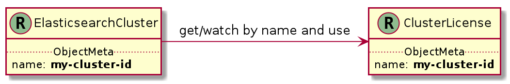

# 3. Associations and relations between resources

* Status: accepted 
* Deciders: k8s team
* Date: 2019-02-12


## Context and Problem Statement

This proposal presents different ways to model associations between resources along with recommendations for when to use them.


## Decision Drivers <!-- optional -->

### Goals

We want to end up with implementations that meet the following goals:

- Discoverable: it should be easy to understand which resources are associated with each-other. This is important in order to avoid a mess of resources where it's difficult to understand what the final result is going to look like. When associated resources are used by a controller, this fact can be made more apparent by an entry in the status sub-resource.

- Maintenance cost (on-going): a low overhead in terms of coding and keeping resources up to date.

- There should only be one source of truth, usually provided by the user.

- If a resource is user-provided, we should not write to its spec, except in rare circumstances -- and then usually only to a well-defined sub-section. (e.g service controllers writing to `.spec.clusterIP`).

- Have one clear owner of each resource object and avoid having multiple writers unless necessary.

### Prior art

#### Horizontal Pod Autoscaler

The [Horizontal Pod Autoscaler](https://kubernetes.io/docs/tasks/run-application/horizontal-pod-autoscale/) is a controller that scales the number of replicas inside a replication controller / replicaset or deployment based on observed metrics (as of this writing, only CPU is fully supported but others are planned / in progress).

To accomplish this, an `HorizontalPodAutoscaler` resource is created that references a "scale target" (e.g the Deployment to scale), a min/max replica count as well as which metrics to trigger scaling on.

Thus, the configuration is external but to effect the change, the Spec of the target resource is changed.

#### Vertical Pod Autoscaler

The [Vertical Pod Autoscaler](https://cloud.google.com/kubernetes-engine/docs/concepts/verticalpodautoscaler) is similar to the HPA, in that it's configuration is defined externally and it updates a subsection of the `.spec` of the target resources (usually through an abstraction such as the `Deployments` resource to handle rolling out the change).

#### Network policies

The [Network Policies](https://kubernetes.io/docs/concepts/services-networking/network-policies) in Kubernetes is a specification of how groups of pods are allowed to communicate with each other and other network endpoints.

A `NetworkPolicy` resource is created for each policy, containing a selector for Pods it should be applied to as well as the spec for the policy (ingress/egress rules).

This means the configuration is fully external to the pods. 

#### Pod disruption budget

The [Pod disruption budget](https://kubernetes.io/docs/concepts/workloads/pods/disruptions/) feature allows application owners to specify how many pods are allowed to be down simultaneously as a result of voluntary disruptions (e.g routine maintenance, not through unexpected downtime/crashes)

Similar to a network policy, the PDB contains a selector for the pods (for which only a single PDB is semantically allowed to match for each given pod) and a `maxUnavailable` setting.

#### Service

In the [Service](https://kubernetes.io/docs/concepts/services-networking/service/) resource, `.spec.clusterIP` is written to by the service controller. This is writing into a subsection of a cluster-provided resource instead of being part of the `.status` sub-resource because it's also the source of truth for this IP (it's not stored anywhere else). The user may delete it to have a new one assigned or provide a custom one that should be used. This is a scenario where a user may provide an optional value which the system can generate a default for.

## Considered Options

What follows is an overview of different implementation options with pros/cons. A diagram with the options is provided for convenience.

The example is trying to solve the use case of:

> As an external controller I would like to be able to inject a user into an existing Elasticsearch (for a specific purpose / role). Examples could be a Kibana server user, a remote monitoring user or a user for CCS/CCR operations.


In this example, the role definitions are not separate resources, which they /could/ be, but that distinction is not important for the sake of serving as an example.

#### Option 0: Embed/extend instead of introducing a separate resource

Extending the existing resource with some new fields is a way to sidestep the discussion if the use case allows for it.

Pros:
  - Single source of configuration makes it easier to reason about the configuration / state a resource should be in.
  
Cons:
  - If this is a piece of configuration that would be managed by a different controller, it's easy to run into an issue with multiple writers issue where more than one controller or process considers itself the full owner of a resource, thus overwriting the resource from another canonical copy/source.


#### Option 1: Reference through simple label value

Add a simple label key/value pair to the source resources (e.g add `elasticsearch.k8s.elastic.co/cluster: foo` to the `User` resource in the example).

Pros:
  - Easy to list and watch for from the target controller.
 
Cons:
  - Complex relations could be difficult to model (e.g something that is relevant to more than one cluster would need multiple labels: `source-cluster: ...`, `target-cluster: ...`?) if there's a possibility they exist in the same namespace or could otherwise be overlapping.

    
#### Option 2: Reference through structured label value

Expanding on option 1, we could store some structured data in the label value, allowing to carry.

Pros:
  - Allows expressing more complex relations without additional labels.

Cons:
  - Requires additional client-side filter for list/watch operations.
  - Not easily validated or type-checked by the API, so syntax errors are much more likely to occur.


#### Option 3: Model the association as part of the source spec

Expands on option 2 by defining the association structure as part of the source resource. This is how it's done for `NetworkPolicy` resources.

Pros:
  - Structure of the relation definition is now validated by the API.
  
Cons:
  - Cannot use filtered listing from the API.
  
This option is suitable when the usage direction of the association goes from the source to the target instead of the other way around: e.g something is layered on top of existing functionality and the existing functionality does not need to do anything to integrate.


#### Option 4: One-to-one mapping

If it's a one-to-one mapping between the source and target, the fact that different types can have the same name can be exploited and the association may be on a per-name basis.



## Decision Outcome

On a general basis, **option 1** should be preferred, but **option 3** is also considered a good choice if it fits the association order better. **Option 4** is the strongest candidate for one-to-one associations.


### Case study: Kibana-to-Elasticsearch association

Kibana requires:
  - Elasticsearch HTTP(s) URL to know where to connect to.
  - Elasticsearch User to perform maintenance tasks.
  - Secure access to the Elasticsearch cluster CA certificates to ensure encryption.

The Kibana resource and controller mandate that it should be possible to use them without the Kibana instance existing within the same namespace (or within the Kubernetes installation), so these should be possible to provide both manually as well as be managed automatically (for the common case of running both ES and Kibana on Kubernetes).

Thus, we create a new association CRD:

```yaml
apiVersion: k8s.elastic.co/v1alpha1
kind: KibanaElasticsearchAssociation
metadata:
  name: foo-bar
  namespace: elastic
spec:
  elasticsearch:
    name: <name of ElasticsearchCluster resource>
    namespace: foo
  kibana:
    name: <name of Kibana resource>
    namespace: bar
```

The association controller will then ensure that Elasticsearch gets a properly configured Kibana user added:
                           
```yaml
apiVersion: elasticsearch.k8s.elastic.co/v1alpha1
kind: User
metadata:
  name: foo-bar-kibana
  namespace: foo
  labels:
    # option 1: uses a simple k/v label
    elasticsearch.k8s.elastic.co/cluster: <cluster id>
spec:
  user: foo-bar-kibana
  password_hash: ...
  <..roles omitted for brevity..>
```

It will also take ownership of the `elasticsearch` section of the Kibana spec:

```yaml
spec:
  elasticsearch:
    url: ...
    auth: ...
    caCertSecret: ... 
```

If the user overwrites this section, it's expected that the association controller will overwrite the users writes.


### Appendix: identified internal use-cases

- Using an ES/Kibana association controller as a more composable alternative to the stack controller:
    - Requires being able to add users to an existing ElasticsearchCluster resource.

- Adding certificates and/or trusted transport node names to clusters for CCR/CCS purposes. The example below is simplified as it does not deal with differences in required configuration between source and target clusters, nor deal with connectivity/discovery information.

```yaml
apiVersion: elasticsearch.k8s.elastic.co/v1alpha1
kind: CCRConfig
metadata:
  name: foo
  namespace: <cluster-namespace>
  labels:
      elasticsearch.k8s.elastic.co/cluster: <cluster id>
spec:
  trustedNamesPattern: "*.node.{remote-cluster-id}.cluster.local"
  trustedCA: CA PEM file contents
```

- For remote monitoring, we would like to set up a user that is allowed to ingest to the target cluster. This can be done by adding a new `User` resource in the same namespace as the ingesting cluster with an appropriate option 1 label to be picked up by the ES controller.

- Snapshot repositories is something that we'd potentially want to centrally manage: 

```yaml
apiVersion: elasticsearch.k8s.elastic.co/v1alpha1
kind: SnapshotRepositoryProvider
metadata:
  name: my-provider
  namespace: elastic
spec:
  credentials:
    secret: <???>
  config: JSON
  clusterSelector:
    matchLabels:
      snapshot-provider: my-provider
```

  Using the above provider we can stamp out instances of the following resource for each matched cluster, and we can potentially keep it up to date with changes to the provider config as well.

```yaml
apiVersion: elasticsearch.k8s.elastic.co/v1alpha1
kind: SnapshotRepository
metadata:
  name: foo
  namespace: <same as cluster>
  labels:
      elasticsearch.k8s.elastic.co/cluster: <cluster id>
spec:
  credentials:
    secret: <???>
  config: JSON
```
